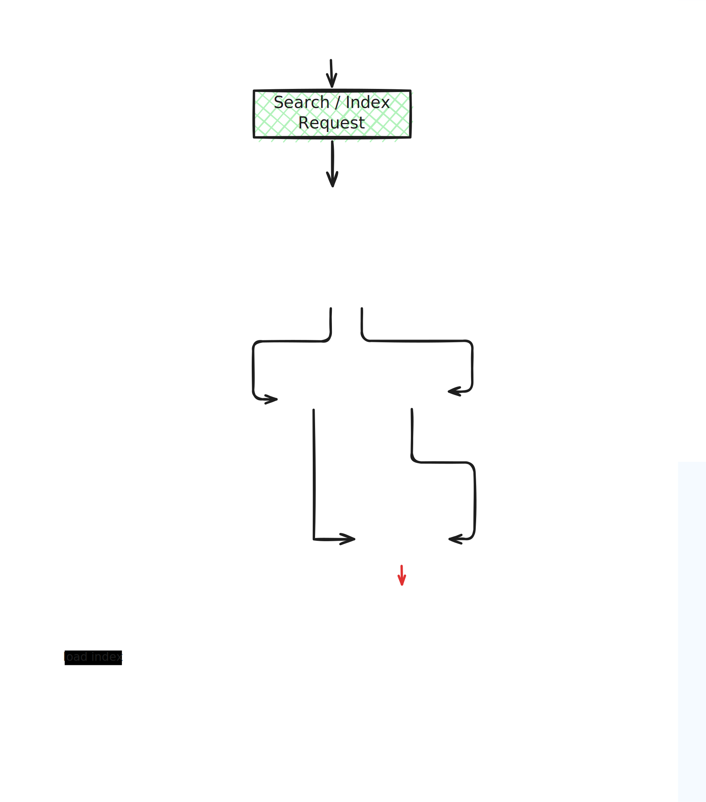

# Image Search Engine

This is a production-grade system built like real-world image search engines. Upload an image, get visually similar results in milliseconds using deep learning embeddings and vector search. The system runs on AWS EKS (Kubernetes), stores images in MongoDB Atlas, uses S3 for artifacts, and scales automatically to handle traffic spikes.

It's designed to handle search request of similar images on huge database while maintaining acceptable response times. During testing the p95 latency was 368ms.

## Table of Contents

- [Overview](#overview)
- [System Architecture](#system-architecture)
- [How it Works](#how-it-works)
- [Requirements](#requirements)
- [Setup](#setup)
- [Configuration](#configuration)
- [Running](#running)
- [Project Structure](#project-structure)
- [API](#api)
- [Training](#training)
- [Deployment](#deployment)
- [Development](#development)

## Overview

This system uses MobileNetV2 to generate image embeddings and FAISS to search for similar images. Images are stored in MongoDB with a FAISS index for fast lookup.

Production Architecture:
- Hosted on AWS EKS (Kubernetes cluster with auto-scaling)
- Images and metadata in MongoDB Atlas (managed cloud database)
- Model checkpoints and indexes stored in S3
- Docker images in AWS ECR (Elastic Container Registry)
- Load-balanced across multiple pods for high availability
- Horizontal scaling based on request volume

## System Architecture



## How it Works

1. Upload an image to the API
2. API processes the image and extracts features using MobileNetV2
3. Features are converted to 1280-dimensional embeddings
4. FAISS searches the index for similar embeddings
5. Matching images from MongoDB are returned

On AWS/Kubernetes:
- Docker image is pushed to AWS ECR
- Kubernetes cluster pulls image from ECR
- LoadBalancer service distributes requests across 2 pod replicas
- Each pod runs the FastAPI service with model and search components

## Requirements

- Python 3.10+
- Docker (for containerization)
- Kubernetes (for deployment)
- MongoDB 4.0+
- 4GB RAM minimum (8GB recommended)
- 10GB+ disk space for models and data

## Setup

Clone and install:

```bash
git clone <repository-url>
cd Image_search_engine_production

# Create virtual environment
python -m venv image-search-prod-env
source image-search-prod-env/bin/activate

# Install dependencies
pip install -r requirements.txt

# Verify installation
python test_environment.py
```

## Configuration

Create a `.env` file:

```
MONGODB_connection_string=mongodb://localhost:27017/image_search
DATABASE_NAME=image_search
COLLECTION_NAME=images
IMAGE_SIZE=224
BATCH_SIZE=32
DEVICE=cuda
INDEX_PATH=./faiss_index/faiss_image_index.index
MODEL_PATH=./checkpoints/cross_entropy_best.pt
CLASS_FILE=./data/processed/classes.json
FAISS_INDEX_DIM=1280
```

Edit `params.yaml` for training:

```yaml
data_spliting:
  test_size: 0.2
  random_state: 42

train_arguments:
  dataset_dir: data/processed
  batch_size: 32
  num_worker: 0
  epoch: 2
  training_type: cross_entropy
  checkpoint_saving_gap: 1
  loss_margin: 2.0
```

## Running

Start the API server:

```bash
# Development
uvicorn src.api.search_system:app --reload --host 0.0.0.0 --port 7192

# Production
gunicorn -w 4 -b 0.0.0.0:7192 "src.api.search_system:app"
```

The API is available at `http://localhost:7192`
- Docs: http://localhost:7192/docs
- ReDoc: http://localhost:7192/redoc

Data processing pipeline:

```bash
# Download raw images from MongoDB
python src/data/data_ingestion.py

# Split into train/test
python src/data/data_spliting.py

# Preprocess data
python src/data/data_process.py

# Run entire pipeline
dvc repro

# Train model
python src/model/model_train.py
```

## Project Structure

```
src/
  api/
    search_system.py        # FastAPI application
  connections/
    mongodb_connection.py   # MongoDB client
  data/
    data_ingestion.py       # Load images from MongoDB
    data_process.py         # Preprocess
    data_spliting.py        # Train/test split
  features/
    features_for_cross_entropy_loss.py
    features_for_triplet_loss.py
    features_for_contrastive_loss.py
  model/
    model_train.py          # Training
    model_inference.py      # Inference
  utils/
    custom_loss.py          # Loss functions
    engine_for_cross_entropy_loss.py
    engine_for_triplet_loss.py
    engine_for_contrastive_loss.py
    model_artifacts.py      # Model utilities
    
data/
  raw/                      # Raw images
  interim/                  # Intermediate processing
  processed/                # Final processed data

checkpoints/                # Saved models
  cross_entropy_best.pt
  cross_entropy_last.pt

faiss_index/                # Search index
  faiss_image_index.index

notebooks/                  # Jupyter notebooks
logs/                       # Application logs
scripts/                    # Utility scripts

dockerfile                  # Docker config
kubectl.yaml                # Kubernetes config
dvc.yaml                    # DVC pipeline
params.yaml                 # Training parameters
requirements.txt            # Python dependencies
setup.py                    # Package setup
```

## API

Search for similar images:
```
POST /search
Content-Type: multipart/form-data

Parameters:
  file: Image file
  top_k: Number of results (default: 5)

Returns:
  {
    "query_image_id": "uuid",
    "similar_images": [
      {
        "image_id": "uuid",
        "similarity_score": 0.95,
        "class": "category-name"
      }
    ],
    "search_time_ms": 125
  }
```

Add image to index:
```
POST /index
Content-Type: multipart/form-data

Parameters:
  file: Image file
  class_name: Image category or label
```

Get image metadata:
```
GET /metadata/{image_id}
```

Check health:
```
GET /health
```

## Training

The model uses MobileNetV2 as the backbone with transfer learning. This allows the model to be trained on limited data while leveraging features learned from ImageNet.

Three loss functions are available:

Cross-Entropy (default):
```bash
# Set in params.yaml
training_type: cross_entropy

python src/model/model_train.py
```

Triplet Loss:
```bash
training_type: triplet

python src/model/model_train.py
```

Contrastive Loss:
```bash
training_type: contrastive

python src/model/model_train.py
```

Training process:
- Backbone: Pre-trained MobileNetV2 (ImageNet)
- Fine-tune final layers with your image data
- Adjust learning rate and epochs in params.yaml
- Models are saved to checkpoints/:
  - `{loss_type}_best.pt` - Best model
  - `{loss_type}_last.pt` - Last epoch

## Deployment

Docker:
```bash
# Build
docker build -t image-search:latest .

# Run
docker run -d \
  -p 7192:7192 \
  -e MONGODB_connection_string="mongodb://..." \
  -v $(pwd)/data:/data \
  -v $(pwd)/checkpoints:/checkpoints \
  --name image-search-container \
  image-search:latest

# Push to AWS ECR
aws ecr get-login-password --region eu-north-1 | \
  docker login --username AWS --password-stdin 644726205307.dkr.ecr.eu-north-1.amazonaws.com

docker tag image-search:latest 644726205307.dkr.ecr.eu-north-1.amazonaws.com/production/image-search:latest
docker push 644726205307.dkr.ecr.eu-north-1.amazonaws.com/production/image-search:latest
```

Kubernetes:
```bash
# Deploy
kubectl apply -f kubectl.yaml

# Check status
kubectl get deployments
kubectl get pods -l app=image-search
kubectl get svc image-search-service

# View logs
kubectl logs -f deployment/image-search

# Scale
kubectl scale deployment image-search --replicas=4
```

The kubectl.yaml creates:
- Deployment with 2 replicas
- LoadBalancer service on port 7192
- CPU request: 1000m, limit: 1700m
- Memory request: 2500Mi, limit: 3000Mi

## Development

Lint code:
```bash
make lint
```

Clean cache:
```bash
make clean
```

Sync data to S3:
```bash
make sync_data_to_s3
```

Sync data from S3:
```bash
make sync_data_from_s3
```

The project uses DVC for pipeline management, Makefile for common commands, and follows standard Python packaging.

---

Author: Mahi_SSL
License: MIT
